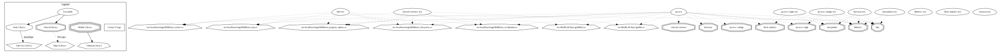

QScores-Archiver
================

Introduction
------------

QScores-Archiver is a system for archiving quality scores in FASTQ formatted next generation sequencing data. To achieve this, it employs lossy and lossless transformations coupled with compression. It is implemented as a command-line tool, but has been developed so that users can link this software with their own source code. This document accompanies the archive, which also includes:
  * source code in C++,
  * other important documentation and license information, and
  * a very small data file for testing.

This archive does not include any binaries. This program is described in the paper:

    R. Wan, V. N. Anh, and K. Asai. "Transformations for the Compression of FASTQ Quality Scores of Next Generation Sequencing Data". Bioinformatics, 28(5):623-635, 2012

which we refer to as "the paper" throughout this document.

The software also includes implementations of static codes, Huffman coding, and interpolative coding as separate C++ classes.  See these papers or books for further details:

* I. H. Witten, A. Moffat, and T. C. Bell.  "Managing Gigabytes", 1999, Second. edition, Morgan Kaufmann.
* A. Moffat and L. Stuiver.  "Binary Interpolative Coding for Effective Index Compression". Information Retrieval 3(1): 25-47 (2000).
* A. Moffat and A. Turpin, "Compression and Coding Algorithms", 2002, Kluwer Academic Publishers.

The software has been updated in 2025 for current compilers.


Requirements
------------

| Software        | Minimum version | Tested version | Required? | Web site                               |
| --------------- | :-------------: | :------------: | :-------: | ------------------------------------- |
| g++             | 5.2.1           | 14.2.0         | Yes       | http://gcc.gnu.org/                   |
| CMake           | 3.5             | 3.30.3         | Yes       | http://www.cmake.org/                 |
| Boost library   | 1.59.0          | 1.87.0         | Yes       | http://www.boost.org/                 |
| zlib library    | 1.2.3           | 1.2.11         | No        | http://www.zlib.net/                  |
| gzip            | 1.3.5           | 1.10           | No        | http://www.gzip.org/                  |
| libbzip library | 1.0.0           | 1.0.8          | No        | http://www.bzip.org/                  |
| bzip2           | 1.0.3           | 1.0.8          | No        | http://www.bzip.org/                  |
| Doxygen         | 1.9.4           | 1.9.8          | No        | http://www.stack.nl/~dimitri/doxygen/ |
| Graphviz        |                 | 2.42.4         | No        | https://www.graphviz.org/download/    | 


Experiments in the paper using QScores-Archiver was executed on Linux systems running Debian 6.0 (squeeze) or CentOS 5.4.  Currently, it is being maintained on an Ubuntu 24.04 system (i.e., it's been tested recently on such a system).

Both optional and required tools for compiling or using QScores-Archiver is listed in the table above.  The column "Minimum version" refers to the software versions used during software development and when running the experiments in the paper.  They do not represent the minimum requirements; it is possible that lower versions can be used.  The column "Tested version" refers to the versions used for the most recent tests on Ubuntu 24.04.

The compression libraries and executables `zlib`, `gzip`, `libbzip`, and `bzip2` are all optional and the software will compile without them.

Doxygen is a documentation system to extract comments that have been placed inline in the source code. See the section below entitled "Software Documentation" for more information.

On a Debian/Ubuntu-based system, the package manager `apt` can be used as follows to install most of the above dependencies (see the next section about Boost):

`sudo apt install cmake gcc g++ doxygen graphviz`


###  Boost library

In addition to the above, the Boost Library must be both installed and compiled to make use of the program_options, system, and filesystem libraries.  There are two options available.

1.  Pre-install Boost before compiling this program.  On a Debian/Ubuntu-based system, the package manager `apt` can be used as follows:

`sudo apt install libboost-program-options-dev libboost-filesystem-dev`

2.  Proceed with configuring QScores-Archiver (see the section "Configuring and Compiling" below) in one of two ways:
    1.  Boost is downloaded from [here](https://www.boost.org/users/download/) and unarchived, but no further configuration or compilation of Boost is done.  When configuring QScores-Archiver, it will be copied from a local directory and compiled.  This is the default and it is assumed that Boost is unarchived in the `/usr/local/boost/` directory (edit the value to the variable `FETCHCONTENT_SOURCE_DIR_BOOST` in `src/cmake/boost.cmake` to change the location).
    2.  Boost is cloned from GitHub and compiled.  To enable this option, edit `src/cmake/boost.cmake` and go to the section with "###############" and read carefully.  Swap the comments around.  The second option only has one command:  CPMAddPackage ()


###  conda

A [conda](https://docs.conda.io/en/latest/) environment can be created to include some of the above dependencies.

To create the environment, type:

    `conda env create -f environment.yml`


###  Docker

A `Dockerfile` has been provided to build a container with all the dependencies installed.  To build the container run:

    docker build -t <name> .


Configuring and Compiling
-------------------------

The QScores-Archiver software is written in C++ and has been compiled using versions 5.2.1 and 9.3.0 of g++. The system has been tested on a 64-bit system, but it should work on other architectures.

CMake (at least version 3.5) is used to compile the software and it is recommended that an "out-of-source" build is performed so as not to clutter the original source directories. We give some brief instructions below on how to do this:
   1.  Set up the dependencies according to the previous section.  In particular, for the Boost library, we have assumed that option 2i. is used.
   2.  Create a directory for the repository [i.e., `~/tmp/`] and clone it into there.
   3.  Enter the `~/tmp/QScores-Archiver/` directory (or whichever name you chose) and create a `build/` directory.  Then, enter it.  (Actually, `build/` can be anywhere, including an entirely separate directory tree.  You can delete it after compilation or you may want to keep it if you plan to re-compile the source code.). Then run,

           cmake ../src
           
   where ".." represents the location of the top-level `CMakeLists.txt` in `~/tmp/QScores-Archiver/src/`. By default, this will set up a `Makefile` to install the program into `/usr/local/`, which would require system administrator access. To use another directory, type this (for example):

           cmake .. -DCMAKE_INSTALL_PREFIX=~/tmp
           
   replacing the installation prefix with whatever you prefer.
   4. Type `make` to compile the C++ source code of QScores-Archiver. If this succeeds, then the executable should be in the build subdirectory as `qscores/qscores-archiver`.
   5. Type `make test` to run through a series of tests. There are 62 tests in total and each one should say **Passed**.
   6. Finally, type `make install` to install the software. This copies the important files from the archive to the installation prefix specified in the `cmake` line above (see "Files_and_Directories" for information about the structure) . The `~/tmp/QScores-Archiver/` directory, including the `build/` directory, can now be deleted, unless you are interested in viewing the source code.

The dependencies between the various modules is depicted in the figure below (generated using `cmake` with the `--graphviz` option):




Software Documentation
----------------------

QScores-Archiver was developed with inline comments that can be extracted using the Doxygen documentation system. They can be created using make as well. Here, we show how to generate the documentation for the QScores-Archiver main code.
   1. When you ran `cmake` (above), add the `-DBUILD_DOCS=ON` flag.
   2. Run `make` as before, which will also generate the documentation in the `doc/` subdirectory.
   2. You may choose to do a `make install` which would put this documentation in the `doc/` subdirectory under the installation prefix. See "Files and Directories" for more information.

The following HTML file can be used if the documentation has been installed:  documentation.html. Of course, the documentation has to be created first according to step 1.


Files and Directories
---------------------

After installation, the following directory structure should result:


    .                           Directory you specified when you ran `cmake`
    ├── bin                     Binary files, including the qscores-archiver executable
    ├── data                    Data directory
    │   ├── sample.qs           Sample data file of 1,000 quality scores of length 100 qscores each
    └── doc                     Documentation directory; Doxygen-generated documents are placed here
        ├── classes.png         Directed graph of dependencies between libraries.
        ├── classes.dia         Graphviz source code for classes.png .
        ├── documentation.html  Top-level HTML file for viewing Doxygen-generated documents
        ├── COPYING             Copy of GNU GPL license v3
        ├── COPYING.DOC         Copy of GNU FDL license v1.3
        ├── COPYING.LESSER      Copy of GNU LGPL license v3
        ├── AUTHORS             Contributors to the software
        └── ChangeLog           History of changes
    
    
If no installation prefix was provided and the installation is performed with root access, then system defaults are used instead.

[*] Source code is not copied when you do a "make install". If you are interested in examining the source, then look under the `src/` directory in the expanded archive.


Running QScores-Archiver
------------------------

### Lossy Transformations

Three lossy transformations have been incorporated into QScores-Archiver. To facilitate the discussion in the paper, their parameters have been unified as |Σ| -- the size of the new alphabet after the transformation. In the program, they actually each have a different parameter, as outlined in the next table.

|Lossy method       |Abbreviation|Parameter |Meaning                          |
|-------------------|------------|----------|---------------------------------|
|Truncation         |trunc       |--trunc x |All qscores larger than x are changed_to_x.|
|Uniform binning    |unibinning  |--unibin x|Bins the error probabilities in a uniform manner by dividing the range of probabilities [0, 1] into_x_bins.|
|Logarithmic binning|logbinning  |--logbin x|Bins the quality scores (which themselves are on a logarithmic scale) so that each bin has x values at most. Binning starts from the lowest PHRED score (i.e., highest error probability). |


The potential confusion is that x has a different meaning in each case but end up achieving the same thing -- reducing the size of the quality scores' alphabet. This reduced alphabet is used for the graphs in the paper. A one-to-many mapping exists between x for each lossy method and |Σ|. For truncation, the mapping is obvious. For the other two cases, in the doc/ directory, we
provide two text files:
  * unibinning.txt
  * logbinning.txt

Both of these files are two-column tables. The first column is the parameter to give to QScores-Archiver (i.e., x) and the second column is the size of the alphabet (i.e., |Σ|). Note that ties in the alphabet size are possible -- logarithmic binning with either 12 quality scores per bin or 13 quality scores per bin will results in an alphabet of size 8. For the paper, even duplicate |Σ| were plotted -- the difference is just too small to notice in the graphs.


### Sample Run

A sample data file "data/sample.qs" is included in the data/ subdirectory. It is a list of 1,000 randomly generated "quality scores" of length 100 each (since they are randomly generated, it is more correct to call them a sequence of characters whose range is stipulated by the Sanger-FASTQ range). Assuming the software has been installed, then this data file and the executable are in the same parent directory. Here are some example executions:

  * Display a list of available options.
    * `./qscores-archiver --help`
      
  * Show the status of externally installed software (i.e., zlib, gzip, etc.)
    * `./qscores-archiver --checkextern`
      
  * Examine the bins created from using logarithmic binning with 2 qscores per bin and Sanger-FASTQ format.
    * `./qscores-archiver --checkbin --mapping sanger --logbin 2`
      
  * Examine the reversed bins created from uniform binning with the interval [0, 1] divided into 10,000 bins.
    * `./qscores-archiver --checkunbin --mapping sanger --unibin 10000`
      
  * Binary encode the test file with verbose output.
    * `./qscores-archiver --input ../data/sample.qs --output test.qs --encode --binary --verbose`
      
  * Binary decode the compressed test file with verbose output
    * `./qscores-archiver --input test.qs --output test-out.qs --decode --verbose`
      
  * Do not perform any transformations or compressions (i.e., the data file is unchanged and is identical to the output).
    * `./qscores-archiver --input ../data/sample.qs --output test.qs --encode --nocompress`
      
  * Perform logarithmic binning with 10 qscores per bin and Gamma code the result. Also, create blocks of 10 reads each.
    * `./qscores-archiver --input ../data/sample.qs --output test.qs --encode --gamma --logbin 10 --blocksize 10`
      

If decoding is being performed and `--nocompress` was not used, then the transformation and compression options are included in the compressed file. So, they do not need to be provided when decompressing. Obviously, if `--nocompress` was selected, then the output cannot be decompressed. This option's purpose is to see the output from the lossy transformations; to make use of them, note that 1-based bin numbers have been encoded. You will need to add 32 to each value to put them into Sanger-FASTQ format.


Future Work
-----------

There are many things that were intended for QScores-Archiver which have not yet been implemented. For example, additional compression methods such as Re-Pair [1,2], Arithmetic coding, and Prediction by Partial Matching were considered. They may still be implemented in the future if there is enough interest from users.

Also, QScores-Archiver does not make use of standard input and output. To be honest, I tried and did not know how in C++ for binary input/output. However, since this would be a useful feature to have to reduce disk I/O if QScores-Archiver is used in a pipeline, this remains a priority for me.

    [1] N. J. Larsson and A. Moffat. Offline Dictionary-Based Compression. In Proc. IEEE, 88(11), 1722-1732, November 2000. 
    [2] See also [Re-Store](https://www.rwanwork.info/en/restore.html).


Installation error messages
---------------------------

The following is are some of the warning or error messages that you might receive during installation of QScores-Archiver.

1.
    ```-- Fetching CPM.cmake from GitHub...
    CMake Warning at ./QScores-Archiver/build/_deps/cpm-src/cmake/CPM.cmake:76 (message):
      CPM: Your project is using an unstable development version of CPM.cmake.
      Please update to a recent release if possible.  See
      https://github.com/cpm-cmake/CPM.cmake for details.
    Call Stack (most recent call first):
      cmake/boost.cmake:54 (include)
      CMakeLists.txt:90 (include)
    ```

    This is just a warning message during configuration and can be ignored.


2.

    ```-- Fetching Boost
    CMake Error at /usr/share/cmake-3.30/Modules/FetchContent.cmake:2057 (message):
      Manually specified source directory is missing:

        FETCHCONTENT_SOURCE_DIR_BOOST --> /usr/local/boost/
    Call Stack (most recent call first):
      /usr/share/cmake-3.30/Modules/FetchContent.cmake:2384 (__FetchContent_Populate)
      ./QScores-Archiver/build/_deps/boost_cmake-src/CMakeLists.txt:38 (FetchContent_MakeAvailable)

    -- Configuring incomplete, errors occurred!
    ```

    This is an error message that indicates that Boost could not be found in the `/usr/local/boost/` directory.  Either unarchive it there or change the location of the directory, as described above in the "Boost library" subsection.


3.

    ```[ 30%] Building CXX object _deps/boost_cmake-build/CMakeFiles/filesystem.dir/usr/local/boost_1_80_0/libs/filesystem/src/operations.cpp.o
    /usr/local/boost_1_80_0/libs/filesystem/src/operations.cpp: In function ‘void boost::filesystem::detail::last_write_time(const boost::filesystem::path&, time_t, boost::system::error_code*)’:
    /usr/local/boost_1_80_0/libs/filesystem/src/operations.cpp:3867:7: error: ‘::utimbuf’ has not been declared
     3867 |     ::utimbuf buf;
          |       ^~~~~~~
    /usr/local/boost_1_80_0/libs/filesystem/src/operations.cpp:3868:5: error: ‘buf’ was not declared in this scope
     3868 |     buf.actime = st.st_atime; // utime() updates access time too :-(
          |     ^~~
    In file included from /usr/local/boost_1_80_0/boost/config.hpp:39,
                     from /usr/local/boost_1_80_0/boost/filesystem/config.hpp:19,
                     from /usr/local/boost_1_80_0/libs/filesystem/src/platform_config.hpp:81,
                     from /usr/local/boost_1_80_0/libs/filesystem/src/operations.cpp:14:
    /usr/local/boost_1_80_0/libs/filesystem/src/operations.cpp:3870:26: error: ‘::utime’ has not been declared; did you mean ‘time’?
     3870 |     if (BOOST_UNLIKELY(::utime(p.c_str(), &buf) < 0))
          |                          ^~~~~
    /usr/local/boost_1_80_0/boost/config/compiler/gcc.hpp:96:44: note: in definition of macro ‘BOOST_UNLIKELY’
       96 | #define BOOST_UNLIKELY(x) __builtin_expect(x, 0)
          |                                            ^
    make[2]: *** [_deps/boost_cmake-build/CMakeFiles/filesystem.dir/build.make:118: _deps/boost_cmake-build/CMakeFiles/filesystem.dir/usr/local/boost_1_80_0/libs/filesystem/src/operations.cpp.o] Error 1
    make[1]: *** [CMakeFiles/Makefile2:164: _deps/boost_cmake-build/CMakeFiles/filesystem.dir/all] Error 2
    make: *** [Makefile:166: all] Error 2
    ```

    This compilation error of Boost occurred for Boost version 1.80.0.  The cause of this error is unknown since earlier versions of Boost was previously fine.  Download the latest version of Boost, or at least version 1.87.0, which has been tested recently.


Acknowledgements
----------------

Configuring and compiling Boost during installation of QScores-Archiver is due to the [boost-cmake](https://github.com/ClausKlein/boost-cmake/) repository of [Claus Klein](https://github.com/ClausKlein) in early 2025.  This is greatly appreciated!  Previously, this software required the user to build and compile Boost.


About QScores-Archiver
----------------------

This software was implemented while I was at the Computational Biology Research Centre (Tokyo, Japan) and the University of Tokyo (around 2010-2011).  My contact details:

     E-mail:  rwan.work@gmail.com 

My homepage is [here](http://www.rwanwork.info/).

The latest version of QScores-Archiver can be downloaded from [GitHub](https://github.com/rwanwork/QScores-Archiver).

If you have any information about bugs, suggestions for the documentation or just have some general comments, feel free to contact me via e-mail or GitHub.


Copyright and License
---------------------

     QScores-Archiver (Quality scores archiver)
     Copyright (C) 2011-2015, 2024-2025 by Raymond Wan

QScores-Archiver is distributed under the terms of the GNU Lesser General Public License (LGPL, version 3 or later) -- see the file COPYING and COPYING.LESSER for details.

Permission is granted to copy, distribute and/or modify this document under the terms of the GNU Free Documentation License, Version 1.3 or any later version published by the Free Software Foundation; with no Invariant Sections, no Front-Cover Texts and no Back-Cover Texts. A copy of the license is included with the archive as COPYING.DOC.

Please see the `doc/` directory for license and documentation.


About This Repository
---------------------

This GitHub repository was created from the original tarball on my homepage many years ago.  Initially, it was identical to the version described in the paper.  Hopefully, it will be easier for me to maintain in GitHub.


    Raymond Wan
    1 March 2025

